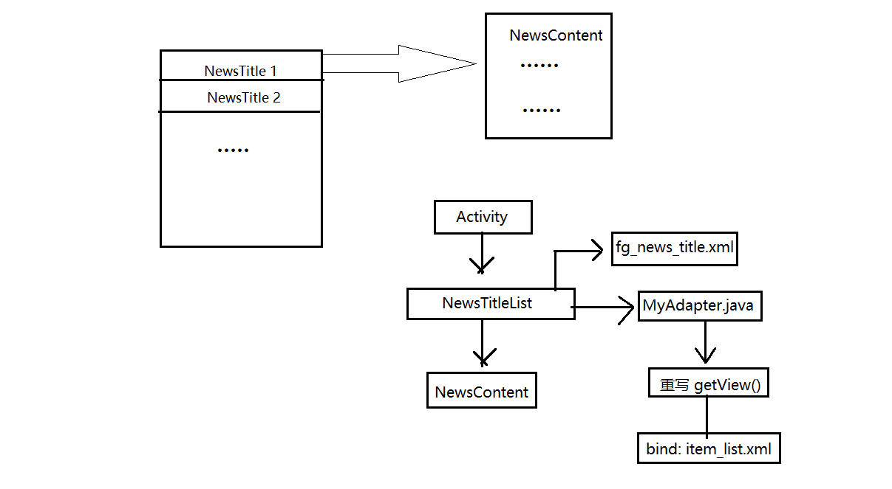
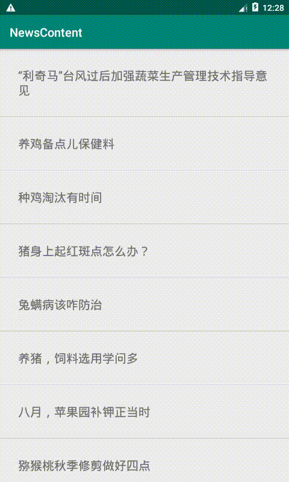

# 2019/8/17总结

## Fragment基本用法

1. UI架构图如下

   

2. *NewsContent* ，*NewTitleList*  两个是 继承了 **Fragment** 类。需要重写 **onCreateView**方法

   > ```java
   >  View view = 	inflater.inflate(R.layout.fg_news_titles, container, false);   
   > ListView  listView = view.findViewById(R.id.list_title);     
   > NewsTitleListViewAdapter myAdapter = new NewsTitleListViewAdapter(mData, 
   >   getActivity());    
   > listView.setAdapter(myAdapter);    
   > listView.setOnItemClickListener(this);    
   > return view;
   > ```

- 其中 主要 是 *inflatr方法*  ， 这个方法是绑定 Layout文件.

- *setAdapter* 设置 适配器 ， 这里设置适配器，在MainActivity 中直接调用 *NewsTitleList* 的构造函数，直接将数据传到  *NewsTitleList* 内部的适配器中.

- *setOnItemClickListener()* 设置点击事件监听. 

  ```java
   public void onItemClick(AdapterView<?> parent, View view, int position, long id) {
  
          NewsContentView newsContentView = new NewsContentView();
          Bundle bundle = new Bundle();
          bundle.putString("content",mData.get(position).getCotent());
          newsContentView.setArguments(bundle);
  
          FragmentTransaction ft = fm.beginTransaction();
          ft.replace(R.id.fl_content,newsContentView);
          ft.addToBackStack(null);
          ft.commit();
  
      }
  ```

  - 这部分代码是，点击事件，具体的业务逻辑是：

    > 1. 点击按钮后，创建 *NewsContentView* 对象。因为*NewsContView* 对象 绑定了另外的 View
    > 2. 数据的传递，将用Gson 解析的 *Json* 传递给 下一个Fragment 其中是采用 Bundle传递的。
    > 3. 开启Fragment事务，将 FrameLayout 布局 替换成 Fragment 布局. 
    >    - replace（FrameLayout的id, 需切换的下一页Fragment
    > 4. **ft.addToBackStack(null)** 这个是，将这个页面 压到 **返回栈中**，等下返回的时候，可以切换到前面的页面去.

## 问题

> 1. 结果虽然可以运行，但是有点小问题，就是每次点击的时候，Content文字内容比较多的时候，会有1秒左右的延迟. 需要优化，如果要优化，需要了解 Fragment 的生命周期 和BackTask的问题。

## 干货博客推荐

关于Fragment 详解的文章

> 1. https://blog.csdn.net/lmj623565791/article/details/37992017
> 2. https://blog.csdn.net/zhangyalong_android/article/details/68942619

## 效果图



